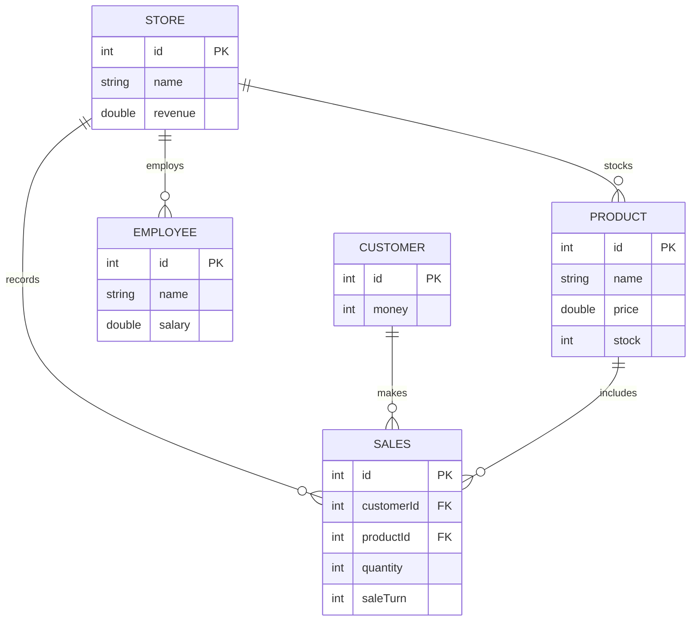

```mermaid
erDiagram
STORE ||--o{ PRODUCT : stocks
STORE ||--o{ EMPLOYEE : employs
STORE ||--o{ SALES : records
CUSTOMER ||--o{ SALES : makes
PRODUCT ||--o{ SALES : includes

    STORE {
        int id PK
        string name
        double revenue
    }

    PRODUCT {
        int id PK
        string name
        double price
        int stock
    }

    EMPLOYEE {
        int id PK
        string name
        double salary
    }

    CUSTOMER {
        int id PK
        int money
    }

    SALES {
        int id PK
        int customerId FK
        int productId FK
        int quantity
        int saleTurn
    }
```