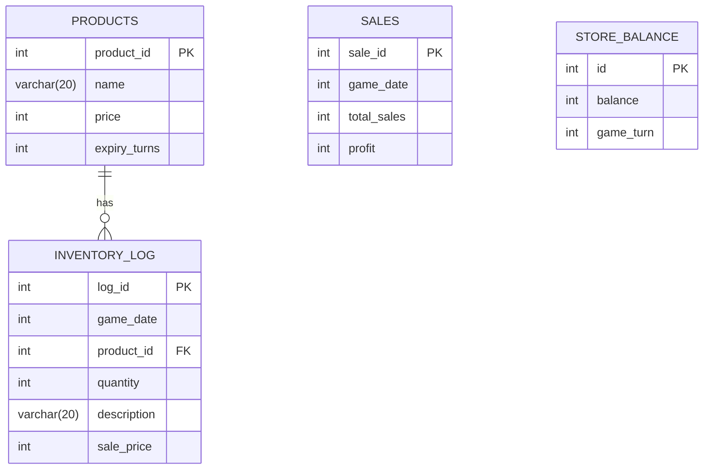

```mermaid
erDiagram
    PRODUCTS ||--o{ INVENTORY_LOG: "has"
    PRODUCTS {
        int product_id PK
        varchar(20) name
        int price
        int expiry_turns
    }
    INVENTORY_LOG {
        int log_id PK
        int game_date
        int product_id FK
        int quantity
        varchar(20) description
        int sale_price
    }
    SALES {
        int sale_id PK
        int game_date
        int total_sales
        int profit
    }
    STORE_BALANCE {
        int id PK
        int balance
        int game_turn
    }
```