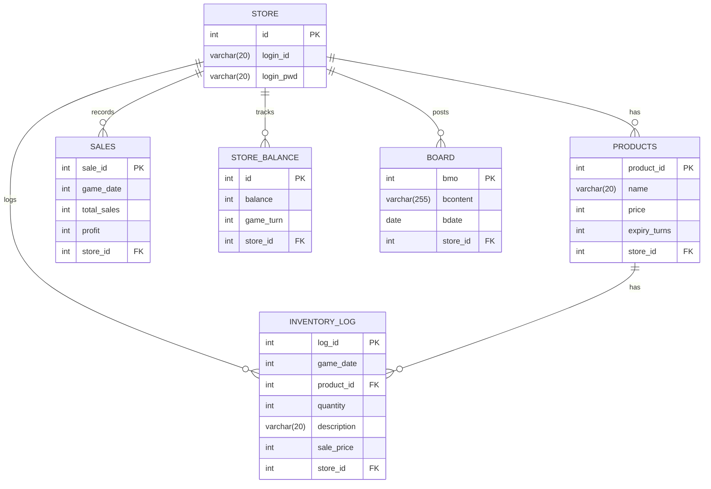

```mermaid
erDiagram
    STORE ||--o{ PRODUCTS: "has"
    STORE ||--o{ INVENTORY_LOG: "logs"
    STORE ||--o{ SALES: "records"
    STORE ||--o{ STORE_BALANCE: "tracks"
    STORE ||--o{ BOARD: "posts"
    PRODUCTS ||--o{ INVENTORY_LOG: "has"
    STORE {
        int id PK
        varchar(20) login_id
        varchar(20) login_pwd
    }
    PRODUCTS {
        int product_id PK
        varchar(20) name
        int price
        int expiry_turns
        int store_id FK
    }
    INVENTORY_LOG {
        int log_id PK
        int game_date
        int product_id FK
        int quantity
        varchar(20) description
        int sale_price
        int store_id FK
    }
    SALES {
        int sale_id PK
        int game_date
        int total_sales
        int profit
        int store_id FK
    }
    STORE_BALANCE {
        int id PK
        int balance
        int game_turn
        int store_id FK
    }
    BOARD {
        int bmo PK
        varchar(255) bcontent
        date bdate
        int store_id FK
    }
```