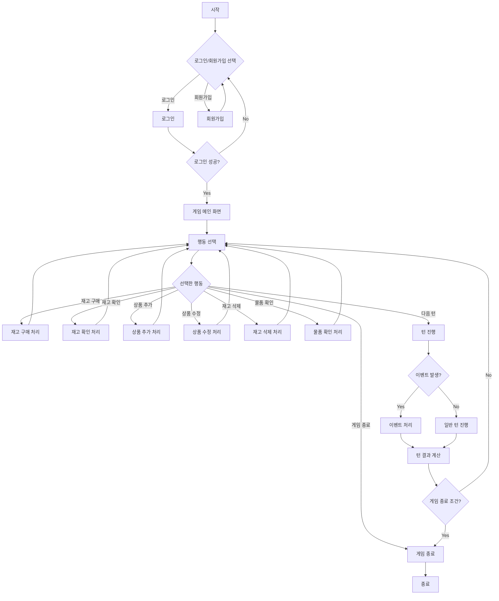

```mermaid
flowchart TD
    A[시작] --> B{로그인/회원가입 선택}
    B -->|로그인| C[로그인]
    B -->|회원가입| D[회원가입]
    C --> E{로그인 성공?}
    E -->|Yes| F[게임 메인 화면]
    E -->|No| B
    D --> B
    F --> G[행동 선택]
    G --> H{선택한 행동}
    H -->|재고 구매| I[재고 구매 처리]
    H -->|재고 확인| J[재고 확인 처리]
    H -->|상품 추가| K[상품 추가 처리]
    H -->|상품 수정| L[상품 수정 처리]
    H -->|재고 삭제| M[재고 삭제 처리]
    H -->|물품 확인| N[물품 확인 처리]
    H -->|다음 턴| O[턴 진행]
    H -->|게임 종료| P[게임 종료]
    I --> G
    J --> G
    K --> G
    L --> G
    M --> G
    N --> G
    O --> Q{이벤트 발생?}
    Q -->|Yes| R[이벤트 처리]
    Q -->|No| S[일반 턴 진행]
    R --> T[턴 결과 계산]
    S --> T
    T --> U{게임 종료 조건?}
    U -->|Yes| P
    U -->|No| G
    P --> V[종료]
```